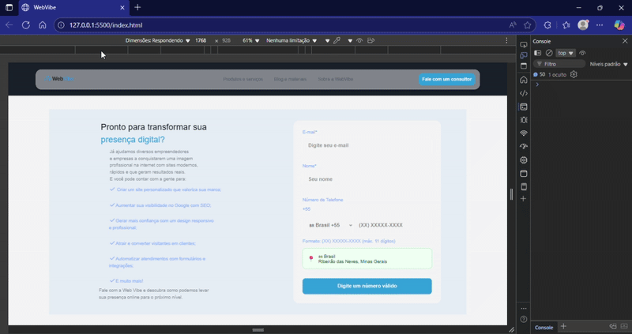

# WebVibe - Landing Page Moderna e Responsiva


## Demonstração


## Descrição do Projeto

O WebVibe é uma landing page moderna e responsiva, desenvolvida para apresentar uma empresa de soluções digitais. O projeto destaca-se pela sua interface intuitiva, design limpo e funcionalidades interativas, como um formulário de contato avançado com detecção automática de país e formatação de telefone. O objetivo principal é converter visitantes em leads, oferecendo informações claras sobre os serviços e um canal de comunicação eficiente.

## Funcionalidades Principais

*   **Cabeçalho Dinâmico**: Menu de navegação responsivo (mobile e desktop) com animações de scroll.
*   **Seção de Apresentação**: Título impactante, descrição dos serviços e botões de chamada para ação, acompanhados de imagens com efeitos visuais.
*   **Seção de Parceiros/Inspirações**: Exibição de logos de empresas (fictícias) que inspiraram o projeto, com animações de aparecimento.
*   **Seção de Serviços**: Detalhamento dos serviços oferecidos (Desenvolvimento de Sites, UX/UI Design, Marketing Digital e Manutenção/Suporte Web), com descrições e botões de solicitação.
*   **Formulário de Contato Avançado**: Formulário completo para coleta de dados (e-mail, nome e telefone), com:
    *   Detecção automática do país do usuário via IP.
    *   Formatação de telefone específica para cada país.
    *   Validação em tempo real do número de telefone.
 
    *   
## Demonstração



*   **Design Responsivo**: Adaptação completa do layout para diferentes tamanhos de tela (desktops, tablets e smartphones), garantindo uma excelente experiência de usuário em qualquer dispositivo.
*   **Animações e Efeitos Visuais**: Utilização de CSS e JavaScript para animações suaves e transições que enriquecem a interação do usuário.

## Tecnologias Utilizadas

O projeto WebVibe foi construído utilizando as seguintes tecnologias:

*   **HTML5**: Estrutura semântica da página.
*   **CSS3**: Estilização, responsividade e animações.
    *   Uso de `@import` para modularização de estilos.
    *   Variáveis CSS para facilitar a manutenção da paleta de cores e tipografia.
*   **JavaScript (ES6+)**: Lógica de interatividade, manipulação do DOM, validação de formulários e detecção de país.
*   **Google Fonts**: Para tipografia personalizada.
*   **Material Symbols Outlined**: Biblioteca de ícones.
*   **intl-tel-input**: Biblioteca JavaScript para o campo de telefone internacional, facilitando a entrada e validação de números de diferentes países.

## Estrutura de Pastas

O projeto segue uma estrutura de pastas organizada para facilitar a manutenção e escalabilidade:

```
webVibe/
├── assets/                 # Contém imagens, ícones e outros recursos estáticos
│   ├── img/
│   │   ├── country-flags-main/ # Bandeiras de países
│   │   ├── logos_ficticias/  # Logos de empresas fictícias
│   │   └── ...
│   └── ...
├── script/                 # Scripts JavaScript
│   ├── header/             # Scripts relacionados ao cabeçalho
│   │   ├── header-menu.js
│   │   └── scroll.js
│   ├── phone-form/         # Scripts relacionados ao formulário de telefone
│   │   ├── countries.js
│   │   └── script.js
│   ├── reusable/           # Scripts reutilizáveis (ex: animações)
│   │   └── fade-in.js
│   ├── load.js             # Script de carregamento
│   ├── partners.js         # Script da seção de parceiros
│   ├── service.js          # Script da seção de serviços
│   └── submit.js           # Script de submissão de formulário
├── styles.css/             # Pastas para estilos CSS modularizados
│   ├── animation/
│   │   └── fade-in.css
│   ├── form/
│   │   └── form.css
│   ├── header/
│   │   └── header.css
│   ├── logo/
│   │   └── logo-empre.css
│   ├── presentation/
│   │   └── Presentation.css
│   └── service.css         # Estilos da seção de serviços
├── style.css               # Folha de estilos principal (importa outros CSS)
├── reset.css               # Reset CSS para padronização de estilos
├── index.html              # Página HTML principal
└── readme.md               # Este arquivo README
```

## Como Rodar o Projeto Localmente

Para visualizar e testar o projeto WebVibe em sua máquina local, siga os passos abaixo:

1.  **Clone o Repositório (ou descompacte o arquivo ZIP)**:
    Se você recebeu o projeto como um arquivo ZIP (`webVibe.zip`), descompacte-o em uma pasta de sua preferência.

2.  **Abra o Arquivo `index.html`**: 
    Navegue até a pasta `webVibe` (ou o nome da pasta onde você descompactou o projeto) e abra o arquivo `index.html` diretamente em seu navegador web (Google Chrome, Mozilla Firefox, Microsoft Edge, etc.).

O projeto será carregado no navegador e você poderá interagir com todas as suas funcionalidades.

## Autor

Manus AI


## Demonstração


